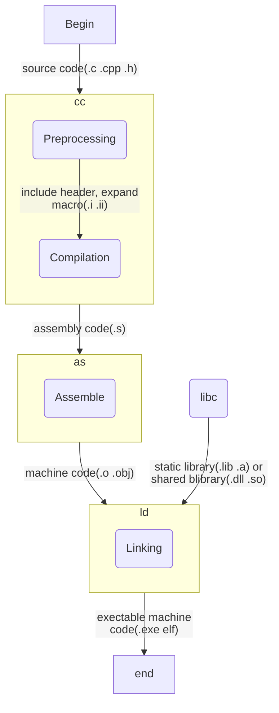

# Compile

_让机器听得懂人话_
## 序言：依旧是 Hello

``` c linenums="1"
#include<stdio.h>

int main() {
	printf("hello, world!\n");
	return 0;
}
```

[《The C Program Language》](https://en.wikipedia.org/wiki/The_C_Programming_Language)出版以来就成为无数程序员入门圣经的 `hello` 程序对吧？OK，我们再来简单地编译、运行一下这个 `hello`：

```sh
$ gcc hello.c -o hello
$ ./hello
hello, world!
```

调 gcc，给出文件名，加一个 `-o`  参数指定输出的可执行文件的文件名，就可以编译出来我们想要的可执行文件，再执行一下它，程序里的字符串就打印出来。

每一个合格的计算机相关专业的大一学生也都知道，这个过程其实就是：


具体一点，其中：

1. 「C代码」是扩展名为 `.c` 的文本文件，内容是字符串
2. 「编译」是用编译器来进行的，编译器也有 gcc、clang 等各种不同的实现
3. 「二进制代码」是扩展名为`.exe` 等（视运行环境而定）的可执行文件，内容是 0101 的位串。

和充满着希望的大一新生相比，我这样的老古董没准要比他们知道的稍微多一点，这篇文章就是要介绍「编译」的过程，同时稍微体现一点老古董对写作技术小品文的思考。后浪们太汹涌了，前浪很害怕。

> **追问三连**
> 
> - 怎么避免内容零碎逻辑不清晰？
> - 怎么避免罗列概念掉书袋装孔老夫子？
> - 怎么避免听君一席话如听一席话，看完大几千字结果只记住了几个天上掉下来的名词？

## 细节：上 log

秉持「从实践中来到实践中去」的思想：要讲「编译」，一个比较好的办法就是直接上手编译一个程序来看看过程！刚刚我们已经编译过一个了，所以现在可以偷个懒。

也就是说，现在，我们需要对 `gcc hello.c -o hello` 这个命令的执行过程做一下考察！我们需要了解关于它的更多信息。

OK，信源又可以分为外部的和内部的，而我们现在显然不想去 Google 其他文章看介绍，也不想找大模型让它从概念上说一堆不明所以的名词——我们现在只是想搞清楚这个命令的执行过程，我们需要它本身给我们更多信息！

**这就引入了 `log` 。**

我们需要了解某个程序本身的执行过程，也就是具体去看它运行时的行为，如此，就可以考虑查看它的运行日志！日志是对程序执行状态的记录，通过它我们可以获取到程序在重要节点上的状态信息。

### 拿到 log

那么怎么看 gcc 的日志？聪明的你肯定敏锐地意识到这是一个需要从外部信源获取信息的问题——Google/问 LLM 一下就可以知道，其实只需要加个 `-v`  的参数就可以了。

```sh
$ gcc -v hello.c -o hello
Using built-in specs.
COLLECT_GCC=gcc
COLLECT_LTO_WRAPPER=/usr/lib/gcc/x86_64-linux-gnu/11/lto-wrapper
OFFLOAD_TARGET_NAMES=nvptx-none:amdgcn-amdhsa
OFFLOAD_TARGET_DEFAULT=1
Target: x86_64-linux-gnu
Configured with: ../src/configure -v --with-pkgversion='Ubuntu 11.4.0-1ubuntu1~22.04' --with-bugurl=file:///usr/share/doc/gcc-11/README.Bugs --enable-languages=c,ada,c++,go,brig,d,fortran,objc,obj-c++,m2 --prefix=/usr --with-gcc-major-version-only --program-suffix=-11 --program-prefix=x86_64-linux-gnu- --enable-shared --enable-linker-build-id --libexecdir=/usr/lib --without-included-gettext --enable-threads=posix --libdir=/usr/lib --enable-nls --enable-bootstrap --enable-clocale=gnu --enable-libstdcxx-debug --enable-libstdcxx-time=yes --with-default-libstdcxx-abi=new --enable-gnu-unique-object --disable-vtable-verify --enable-plugin --enable-default-pie --with-system-zlib --enable-libphobos-checking=release --with-target-system-zlib=auto --enable-objc-gc=auto --enable-multiarch --disable-werror --enable-cet --with-arch-32=i686 --with-abi=m64 --with-multilib-list=m32,m64,mx32 --enable-multilib --with-tune=generic --enable-offload-targets=nvptx-none=/build/gcc-11-XeT9lY/gcc-11-11.4.0/debian/tmp-nvptx/usr,amdgcn-amdhsa=/build/gcc-11-XeT9lY/gcc-11-11.4.0/debian/tmp-gcn/usr --without-cuda-driver --enable-checking=release --build=x86_64-linux-gnu --host=x86_64-linux-gnu --target=x86_64-linux-gnu --with-build-config=bootstrap-lto-lean --enable-link-serialization=2
Thread model: posix
Supported LTO compression algorithms: zlib zstd
gcc version 11.4.0 (Ubuntu 11.4.0-1ubuntu1~22.04)
COLLECT_GCC_OPTIONS='-v' '-o' 'hello' '-mtune=generic' '-march=x86-64'
 /usr/lib/gcc/x86_64-linux-gnu/11/cc1 -quiet -v -imultiarch x86_64-linux-gnu hello.c -quiet -dumpbase hello.c -dumpbase-ext .c -mtune=generic -march=x86-64 -version -fasynchronous-unwind-tables -fstack-protector-strong -Wformat -Wformat-security -fstack-clash-protection -fcf-protection -o /tmp/ccen7Fxl.s
GNU C17 (Ubuntu 11.4.0-1ubuntu1~22.04) version 11.4.0 (x86_64-linux-gnu)
	compiled by GNU C version 11.4.0, GMP version 6.2.1, MPFR version 4.1.0, MPC version 1.2.1, isl version isl-0.24-GMP

GGC heuristics: --param ggc-min-expand=100 --param ggc-min-heapsize=131072
ignoring nonexistent directory "/usr/local/include/x86_64-linux-gnu"
ignoring nonexistent directory "/usr/lib/gcc/x86_64-linux-gnu/11/include-fixed"
ignoring nonexistent directory "/usr/lib/gcc/x86_64-linux-gnu/11/../../../../x86_64-linux-gnu/include"
#include "..." search starts here:
#include <...> search starts here:
 /usr/lib/gcc/x86_64-linux-gnu/11/include
 /usr/local/include
 /usr/include/x86_64-linux-gnu
 /usr/include
End of search list.
GNU C17 (Ubuntu 11.4.0-1ubuntu1~22.04) version 11.4.0 (x86_64-linux-gnu)
	compiled by GNU C version 11.4.0, GMP version 6.2.1, MPFR version 4.1.0, MPC version 1.2.1, isl version isl-0.24-GMP

GGC heuristics: --param ggc-min-expand=100 --param ggc-min-heapsize=131072
Compiler executable checksum: 50eaa2331df977b8016186198deb2d18
COLLECT_GCC_OPTIONS='-v' '-o' 'hello' '-mtune=generic' '-march=x86-64'
 as -v --64 -o /tmp/cc75m0ed.o /tmp/ccen7Fxl.s
GNU assembler version 2.38 (x86_64-linux-gnu) using BFD version (GNU Binutils for Ubuntu) 2.38
COMPILER_PATH=/usr/lib/gcc/x86_64-linux-gnu/11/:/usr/lib/gcc/x86_64-linux-gnu/11/:/usr/lib/gcc/x86_64-linux-gnu/:/usr/lib/gcc/x86_64-linux-gnu/11/:/usr/lib/gcc/x86_64-linux-gnu/
LIBRARY_PATH=/usr/lib/gcc/x86_64-linux-gnu/11/:/usr/lib/gcc/x86_64-linux-gnu/11/../../../x86_64-linux-gnu/:/usr/lib/gcc/x86_64-linux-gnu/11/../../../../lib/:/lib/x86_64-linux-gnu/:/lib/../lib/:/usr/lib/x86_64-linux-gnu/:/usr/lib/../lib/:/usr/lib/gcc/x86_64-linux-gnu/11/../../../:/lib/:/usr/lib/
COLLECT_GCC_OPTIONS='-v' '-o' 'hello' '-mtune=generic' '-march=x86-64' '-dumpdir' 'hello.'
 /usr/lib/gcc/x86_64-linux-gnu/11/collect2 -plugin /usr/lib/gcc/x86_64-linux-gnu/11/liblto_plugin.so -plugin-opt=/usr/lib/gcc/x86_64-linux-gnu/11/lto-wrapper -plugin-opt=-fresolution=/tmp/cceWsRsk.res -plugin-opt=-pass-through=-lgcc -plugin-opt=-pass-through=-lgcc_s -plugin-opt=-pass-through=-lc -plugin-opt=-pass-through=-lgcc -plugin-opt=-pass-through=-lgcc_s --build-id --eh-frame-hdr -m elf_x86_64 --hash-style=gnu --as-needed -dynamic-linker /lib64/ld-linux-x86-64.so.2 -pie -z now -z relro -o hello /usr/lib/gcc/x86_64-linux-gnu/11/../../../x86_64-linux-gnu/Scrt1.o /usr/lib/gcc/x86_64-linux-gnu/11/../../../x86_64-linux-gnu/crti.o /usr/lib/gcc/x86_64-linux-gnu/11/crtbeginS.o -L/usr/lib/gcc/x86_64-linux-gnu/11 -L/usr/lib/gcc/x86_64-linux-gnu/11/../../../x86_64-linux-gnu -L/usr/lib/gcc/x86_64-linux-gnu/11/../../../../lib -L/lib/x86_64-linux-gnu -L/lib/../lib -L/usr/lib/x86_64-linux-gnu -L/usr/lib/../lib -L/usr/lib/gcc/x86_64-linux-gnu/11/../../.. /tmp/cc75m0ed.o -lgcc --push-state --as-needed -lgcc_s --pop-state -lc -lgcc --push-state --as-needed -lgcc_s --pop-state /usr/lib/gcc/x86_64-linux-gnu/11/crtendS.o /usr/lib/gcc/x86_64-linux-gnu/11/../../../x86_64-linux-gnu/crtn.o
COLLECT_GCC_OPTIONS='-v' '-o' 'hello' '-mtune=generic' '-march=x86-64' '-dumpdir' 'hello.'
```

大量信息从终端中奔涌而出，居然原来什么也没输出的背后还潜藏着这么多的东西！这么多东西我们全看懂也不现实，但这不影响我们从事物本质的角度来剖析它。我们现在需要做的是从 `log`  里抽丝剥茧找到能描述清楚编译过程的信息，所以只需要看那种可以区分出来程序行为的不同阶段的内容就可以了。

以终端里空出来的回车换行为分界点：

### 分析 log

第一段，可以发现有一些 gcc 的版本（`gcc version 11.4.0 (Ubuntu 11.4.0-1ubuntu1~22.04)`）和运行环境信息（`Target: x86_64-linux-gnu`），大概率是一些初始化还有状态检查的东西，这些不是我们需要主要关心的，PASS。

但是其中有两行是我们比较感兴趣的东西：

```sh linenums="1"
COLLECT_GCC_OPTIONS='-v' '-o' 'hello' '-mtune=generic' '-march=x86-64'
 /usr/lib/gcc/x86_64-linux-gnu/11/cc1 -quiet -v -imultiarch x86_64-linux-gnu hello.c -quiet -dumpbase hello.c -dumpbase-ext .c -mtune=generic -march=x86-64 -version -fasynchronous-unwind-tables -fstack-protector-strong -Wformat -Wformat-security -fstack-clash-protection -fcf-protection -o /tmp/ccen7Fxl.s
```

1、**COLLECT_GCC_OPTIONS** 是收集到的传递给 gcc 的选项。`-v` 表示显示详细的编译过程，`-o hello` 指定输出文件名为 `hello`，`-mtune=generic` 和 `-march=x86-64` 我们不了解，但猜测也是系统默认加上的和 x86-64 架构有关的参数，可以不重点 care。

2、它不是参数列表，也不是路径，也不是某个携带信息的纯字符串，那么在 Linux 里大概率就是一个命令，或者说就是一个可执行文件，后面的就是给它的参数。这个程序叫 `cc1`，可以发现携带了上面 `COLLECT_GCC_OPTIONS` 中的参数，而且还对 `hello.c` 和 `ccen7Fxl.s` 这两个文件做了操作。大胆猜测，`ccen7Fxl.s` 是不是 `hello.c` 经过 `cc1` 处理以后的输出？

第二段，可以发现这一段里也有一些我们感兴趣的东西：gcc 打印出三行 `ignoring nonexistent directory` ，字面意思就是说忽略了这三个不存在的路径；还有两行 `#include "/<..."/> search starts here:` ，其中 `"..."` 的没东西、`<...>` 的有四个路径（联系起来 C 中引号是自定义库，尖括号是系统库）；最后还说 `End of search list.` 。而且，仔细看会发现这几个路径里都有「include」。

联系一下 C 语言的语法细节——那么这一段大概率就是在找 `#include` 关键字后面的那个 `stdio.h` 了！

看一下对应路径里的内容有没有我们需要的东西：

```sh
$ ls -al /usr/lib/gcc/x86_64-linux-gnu/11/include | grep stdio.h
$ ls -al /usr/local/include | grep stdio.h
$ ls -al /usr/include/x86_64-linux-gnu | grep stdio.h
$ ls -al /usr/include | grep stdio.h
-rw-r--r--  1 root root  31176 Apr 16 21:40 stdio.h
```

果真在第四个路径里！好了，这下 double check 了，log 里的第二段就是在找对应的头文件！到此，日志的 $2/3$ 我们都看过了。

```sh linenums="1"
GGC heuristics: --param ggc-min-expand=100 --param ggc-min-heapsize=131072
Compiler executable checksum: 50eaa2331df977b8016186198deb2d18
COLLECT_GCC_OPTIONS='-v' '-o' 'hello' '-mtune=generic' '-march=x86-64'
 as -v --64 -o /tmp/cc75m0ed.o /tmp/ccen7Fxl.s
GNU assembler version 2.38 (x86_64-linux-gnu) using BFD version (GNU Binutils for Ubuntu) 2.38
COMPILER_PATH=/usr/lib/gcc/x86_64-linux-gnu/11/:/usr/lib/gcc/x86_64-linux-gnu/11/:/usr/lib/gcc/x86_64-linux-gnu/:/usr/lib/gcc/x86_64-linux-gnu/11/:/usr/lib/gcc/x86_64-linux-gnu/
LIBRARY_PATH=/usr/lib/gcc/x86_64-linux-gnu/11/:/usr/lib/gcc/x86_64-linux-gnu/11/../../../x86_64-linux-gnu/:/usr/lib/gcc/x86_64-linux-gnu/11/../../../../lib/:/lib/x86_64-linux-gnu/:/lib/../lib/:/usr/lib/x86_64-linux-gnu/:/usr/lib/../lib/:/usr/lib/gcc/x86_64-linux-gnu/11/../../../:/lib/:/usr/lib/
COLLECT_GCC_OPTIONS='-v' '-o' 'hello' '-mtune=generic' '-march=x86-64' '-dumpdir' 'hello.'
 /usr/lib/gcc/x86_64-linux-gnu/11/collect2 -plugin /usr/lib/gcc/x86_64-linux-gnu/11/liblto_plugin.so -plugin-opt=/usr/lib/gcc/x86_64-linux-gnu/11/lto-wrapper -plugin-opt=-fresolution=/tmp/cceWsRsk.res -plugin-opt=-pass-through=-lgcc -plugin-opt=-pass-through=-lgcc_s -plugin-opt=-pass-through=-lc -plugin-opt=-pass-through=-lgcc -plugin-opt=-pass-through=-lgcc_s --build-id --eh-frame-hdr -m elf_x86_64 --hash-style=gnu --as-needed -dynamic-linker /lib64/ld-linux-x86-64.so.2 -pie -z now -z relro -o hello /usr/lib/gcc/x86_64-linux-gnu/11/../../../x86_64-linux-gnu/Scrt1.o /usr/lib/gcc/x86_64-linux-gnu/11/../../../x86_64-linux-gnu/crti.o /usr/lib/gcc/x86_64-linux-gnu/11/crtbeginS.o -L/usr/lib/gcc/x86_64-linux-gnu/11 -L/usr/lib/gcc/x86_64-linux-gnu/11/../../../x86_64-linux-gnu -L/usr/lib/gcc/x86_64-linux-gnu/11/../../../../lib -L/lib/x86_64-linux-gnu -L/lib/../lib -L/usr/lib/x86_64-linux-gnu -L/usr/lib/../lib -L/usr/lib/gcc/x86_64-linux-gnu/11/../../.. /tmp/cc75m0ed.o -lgcc --push-state --as-needed -lgcc_s --pop-state -lc -lgcc --push-state --as-needed -lgcc_s --pop-state /usr/lib/gcc/x86_64-linux-gnu/11/crtendS.o /usr/lib/gcc/x86_64-linux-gnu/11/../../../x86_64-linux-gnu/crtn.o
COLLECT_GCC_OPTIONS='-v' '-o' 'hello' '-mtune=generic' '-march=x86-64' '-dumpdir' 'hello.'
```

第三段：

4、**as**，一个叫 `as` 的程序，可以发现是对系统临时路径里的后缀为 `.o` 和 `.s` 的文件做操作。而且，`ccen7Fxl.s` 这个文件又出现了！

5、**版本信息**，本来不需要关注，但是这里不是 compiler 编译器，而是一个叫做 assembler 的程序，这就需要额外关注了。盲猜就是上面的 `as`。

6、**COMPILER_PATH 和 LIBRARY_PATH**，编译器和库路径，**为什么编译器的路径要在这里给出来？又为什么和库路径一起给出来？**

8、**COLLECT_GCC_OPTIONS**，又显示了一遍收集到的给 gcc 的选项，但是比第 3 行多了一个选项： `-dumpdir hello.`，和 `hello` 程序的 `dumpdir` 有关。

9、**collect2**，和 `as` 类似，是一个命令，但是后面的参数却长得多。仔细观察可以发现，其中主要涉及到的文件类型有两种：`.so` 和 `.o`，那么这里的 `.o` 文件会不会和第 4 行 `as` 的 `.o` 文件有关系？再仔细看，会发现 `cc75m0ed.o` 这个文件真还出现在了这一行的参数里！

10、**COLLECT_GCC_OPTIONS**，最后又出现了一遍和第 8 行完全一致的参数列表。

虽然依旧存在很多疑问，但是我们起码从第三段里可以抽象出来：编译的过程，需要先处理头文件，准确来说是找到对应的头文件，然后调用一个叫做 `as` 的程序，再调用一个叫 `collect2` 的程序，而且 `as` 输出的 `.o` 文件还是 `collect2` 的一个重要输入。

那么我们完全可以去看一下那两个 `/tmp/cc75m0ed.o` 和 `/tmp/ccen7Fxl.s` 文件的内容：

```sh
$ cat /tmp/cc75m0ed.o
cat: /tmp/cc75m0ed.o: No such file or directory
```
 
 但是很遗憾，gcc 貌似不想让我们看到它们，把它们放在了系统 `/tmp` 目录下，随着上面 gcc 进程生命周期的结束，这个文件也被删除了。

难道我们真就看不到这个文件了？不！我们可以继续 Google/问 LLM，之后就可以发现 `-save-temps` 这个参数：

```sh
$ gcc -save-temps hello.c -o hello
$ ll
total 48K
-rwxrwxr-x 1 ghzhang ghzhang  16K May 29 04:00 hello*
-rw-rw-r-- 1 ghzhang ghzhang   73 May 29 02:50 hello.c
-rw-rw-r-- 1 ghzhang ghzhang  18K May 29 04:00 hello.i
-rw-rw-r-- 1 ghzhang ghzhang 1.5K May 29 04:00 hello.o
-rw-rw-r-- 1 ghzhang ghzhang  666 May 29 04:00 hello.s
```

也就是说，从 `hello.c` 开始，编译过程中会产生这三个中间文件，最后产生 `hello` 这个可执行文件。那么我们分别打印它们看看：

```sh
$ cat hello.i
# 0 "hello.c"
# 0 "<built-in>"
# 0 "<command-line>"
# 1 "/usr/include/stdc-predef.h" 1 3 4
# 0 "<command-line>" 2
# 1 "hello.c"
# 1 "/usr/include/stdio.h" 1 3 4
# 27 "/usr/include/stdio.h" 3 4
# 1 "/usr/include/x86_64-linux-gnu/bits/libc-header-start.h" 1 3 4
# 33 "/usr/include/x86_64-linux-gnu/bits/libc-header-start.h" 3 4
......
# 209 "/usr/lib/gcc/x86_64-linux-gnu/11/include/stddef.h" 3 4
typedef long unsigned int size_t;
# 34 "/usr/include/stdio.h" 2 3 4
......
# 1 "/usr/include/x86_64-linux-gnu/bits/types/__mbstate_t.h" 1 3 4
# 13 "/usr/include/x86_64-linux-gnu/bits/types/__mbstate_t.h" 3 4
typedef struct
{
  int __count;
  union
  {
    unsigned int __wch;
    char __wchb[4];
  } __value;
} __mbstate_t;
# 6 "/usr/include/x86_64-linux-gnu/bits/types/__fpos_t.h" 2 3 4
......
struct _IO_FILE;
......
extern int remove (const char *__filename) __attribute__ ((__nothrow__ , __leaf__));
......
# 885 "/usr/include/stdio.h" 3 4
extern int __uflow (FILE *);
extern int __overflow (FILE *, int);
# 902 "/usr/include/stdio.h" 3 4
# 2 "hello.c" 2
# 3 "hello.c"
int main() {
 printf("hello, world!\n");
 return 0;
}
```

`hello.i` 文件的内容很长，做一些精简处理后可以发现，实际上是把一些内容给替换到了原来 `#include<stdio.h>` 的位置，我们写的用户代码进行了保留。也就是说，`hello.i` 文件对应的是 log 第二段对头文件进行处理的部分。

再看 `hello.s` 文件：

```sh
$ cat hello.s
	.file	"hello.c"
	.text
	.section	.rodata
.LC0:
	.string	"hello, world!"
	.text
	.globl	main
	.type	main, @function
main:
.LFB0:
	.cfi_startproc
	endbr64
	pushq	%rbp
	.cfi_def_cfa_offset 16
	.cfi_offset 6, -16
	movq	%rsp, %rbp
	.cfi_def_cfa_register 6
	leaq	.LC0(%rip), %rax
	movq	%rax, %rdi
	call	puts@PLT
	movl	$0, %eax
	popq	%rbp
	.cfi_def_cfa 7, 8
	ret
	.cfi_endproc
.LFE0:
	.size	main, .-main
	.ident	"GCC: (Ubuntu 11.4.0-1ubuntu1~22.04) 11.4.0"
	.section	.note.GNU-stack,"",@progbits
	.section	.note.gnu.property,"a"
	.align 8
	.long	1f - 0f
	.long	4f - 1f
	.long	5
0:
	.string	"GNU"
1:
	.align 8
	.long	0xc0000002
	.long	3f - 2f
2:
	.long	0x3
3:
	.align 8
4:
```

原来是汇编！而且是典型的 x86-64 汇编，也就是说，`cc1` 这个程序把 `hello.c` 处理成了 `hello.s` 的 x86-64 汇编！同样，顺藤摸瓜，比葫芦画瓢：

```sh
$ cat hello.o
U�UH��H�H����]�hello, world!GCC: (Ubuntu 11.4.0-1ubuntu1~22.04) 11.4.0GNU�zR�E�C
��	hello.cmainputs
                       ���������������� .symtab.strtab.shstrtab.rela.text.data.bss.rodata.comment.note.GNU-stack.note.gnu.property.rela.eh_frame @@�0
                                                                                                                                                    &^^1^90l,B�R�j�e@�
      ���
        	��t⏎
```

`as` 又把 x86-64 汇编处理成了一个其中包含大量不可读的字符的文件，那干脆把 `hello` 文件也输出一下，做个比较：

```sh
$ cat hello
@@@@�((uu   ���-�=�=X`�-�=�=�8880hhhDDS�td8880P�td   44Q�tdR�td�-�=�=HH/lib64/ld-linux-x86-64.so.2 GNU���GNUf_Kwt�jG���A%������GNU��e�mH "d s "__cxa_finalize__libc_start_mainputslibc.so.6GLIBC_2.2.5GLIBC_2.34_ITM_deregisterTMCloneTable__gmon_start___ITM_registerTMCloneTable'ui	1���=�@�?�?�?�?�?�?��H�H��/H��t��H���5�/��%�/��h�����������%�/D����%u/D��1�I��^H��H���PTE1�1�H�=��S/�f.�H�=y/H�r/H9�tH�6/H��t	�����H�=I/H�5B/H)�H��H��?H��H�H��tH�/H����fD����=/u+UH�=�.H��t
                                                                                                                                                      H�=�.�����d�����.]������w�����UH��H��H��������]���H�H��hello, world!;0
                                                       ���d,����<����L���L5����zR�����&D$4���� FJ
U                                                                                                �?:*3$"\����t�����q���E�C
@'
h�����o���
�
 �?�  �������o ���o���o���o�=@GCC: (Ubuntu 11.4.0-1ubuntu1~22.04) 11.4.0��	� ��� �3I@U�=|@��=������� ����=� ��?�
                                                                                                                      H @(9@@hF@S @o ~@L`&�@�I�@� �"�
                                                                                                                                                     Scrt1.o__abi_tagcrtstuff.cderegister_tm_clones__do_global_dtors_auxcompleted.0__do_global_dtors_aux_fini_array_entryframe_dummy__frame_dummy_init_array_entryhello.c__FRAME_END___DYNAMIC__GNU_EH_FRAME_HDR_GLOBAL_OFFSET_TABLE___libc_start_main@GLIBC_2.34_ITM_deregisterTMCloneTableputs@GLIBC_2.2.5_edata_fini__data_start__gmon_start____dso_handle_IO_stdin_used_end__bss_startmain__TMC_END___ITM_registerTMCloneTable__cxa_finalize@GLIBC_2.2.5_init.symtab.strtab.shstrtab.interp.note.gnu.property.note.gnu.build-id.note.ABI-tag.gnu.hash.dynsym.dynstr.gnu.version.gnu.version_r.rela.dyn.rela.plt.init.plt.got.plt.sec.text.fini.rodata.eh_frame_hdr.eh_frame.init_array.fini_array.dynamic.data.bss.comment#886hh$I�� W���o��a
�  �  4�H H ������=�-��?�@0             ��i���q���o~���o  �PP���   �@@�PP�``�hh
                         @00+@0`�3�{5⏎
```

可以看到，最后的 `hello` 在 `hello.o` 的基础上加了很多东西，还出现了 `lib64/ld-linux-x86-64.so.2` 这样的东西——盲猜和那个处理 `.so` 文件的 `collect2` 有关！

### 抽象概念

好了，我们终于可以在头脑里形成一个概念性的过程了：


但是那个 `hello.i` 文件呢？考虑到它并没有对我们的用户代码做大幅修改，也没有调用像是 `cc1` 这样的程序，它应该就是在最前面的一个流程：


真是一段漫长的旅程呢，我们看了那么多的 log 和中间文件，最后只推理得到了一个这样的概念性的图示。到这里，前面那些细节就可以忘掉了。
## 理论：CALL + 经典三幕剧

### 经典编译理论

我们终于要介绍一下理论上的编译过程了，有了前面的铺垫，对理论的理解也会更轻松和透彻一些：



如上图所示，一个 `gcc -o hello.exe hello.c`的编译步骤如下：

1. 预处理：编译器 `cc` 主要是做包含头文件（`#include`）以及扩展宏（`#define`）的操作，更具体地说，就是把头文件和宏都做替换。生成的中间文件 `hello.i` 包含预处理后的源代码
2. 编译：编译器 `cc` 将预处理的源代码编译为面向特定体系结构的汇编代码。生成的汇编文件为 `hello.s`
3. 汇编：汇编器 `as` 将汇编代码转换为目标文件 `hello.o`中的机器代码，更具体地，就是把汇编代码按照指令集手册的标准转换为 0101 序列，即机器代码
4. 链接：最后，链接器（`ld`）将目标文件与库文件链接起来，生成可执行文件 `hello`

这个过程中值得细说的东西还有很多。

结合我们上文对 gcc 编译日志的分析，首先，子程序 `cc1` 会被调用，触发「compilation」阶段，在这个阶段的处理过程中，遇到头文件或者宏时，会进入「preprocessing」阶段，做对应文件的替换或者宏展开，二者交替进行，最终生成完整的 `hello.s` 文件。

「assemble」阶段之后，`hello.s` 文件会被汇编成二进制的 `hello.o` 文件，也有人把这种文件叫做 _relocatable object file_，直译为 _可重定位目标文件_，具体含义是指该文件中没有对引用的系统库或其他第三方库做链接，所以是地址无关的一种文件，也不能直接运行，故「可重定位」。

具体地说，比如我们的 `hello.c` 中调用了 `stdio` 标准库中的 `printf` 函数，但我们只包含了 `stdio.h` 的头文件，头文件中又没有这个函数的具体实现，只有一个声明而已，那 `printf` 函数的实现究竟在哪？答案就是 libc，也就是对 C 标准库的一个实现。但是，在链接上 libc 这种标准库或者我们自己需要的第三方库之前，我们在做函数调用时并不能确定该函数跳转的位置，这就是所谓的「可重定位」的一个体现。

#### 额外的链接分析

那么链接阶段又如何呢？好吧链接又分为 Static Linking 和 Dynamic Linking，分别对应于 Static Libraries (.lib .a) 和 Shared Library (.dll .so)。区别就是前者是直接将目标文件和静态库文件打包合并为最终的可执行文件，而后者则是把共享库的一个「特殊指针」写到目标文件中，待目标文件执行需要用到共享库时，再做动态的调用。

对应的优劣势也是显然的：静态链接的程序对运行时环境（runtime）的要求更低，但费空间，动态链接则反过来：省空间，库文件可复用，但万一运行时环境中没有对应的库文件，程序就跑不起来了。

可以做个小小的测试：

```sh
$ gcc -o hello_static hello.c -static
$ gcc -o hello_dynamic hello.c
$ file hello_static
hello_static: ELF 64-bit LSB executable, x86-64, version 1 (GNU/Linux), statically linked, BuildID[sha1]=f5e96a4b7db3667493ac65f24e2de5fdcb78a4d1, for GNU/Linux 3.2.0, not stripped
$ file hello_dynamic
hello_dynamic: ELF 64-bit LSB pie executable, x86-64, version 1 (SYSV), dynamically linked, interpreter /lib64/ld-linux-x86-64.so.2, BuildID[sha1]=665f4b77749f6a479ac9cd41259b9bdf0e9e88ed, for GNU/Linux 3.2.0, not stripped
$ ll
total 900K
-rw-rw-r-- 1 ghzhang ghzhang   73 May 29 02:50 hello.c
-rwxrwxr-x 1 ghzhang ghzhang  16K May 29 18:20 hello_dynamic*
-rwxrwxr-x 1 ghzhang ghzhang 880K May 29 18:20 hello_static*
```

结果是显然的。静态链接的程序比动态链接的大了 $55$ 倍！我们还可以看到动态链接的程序用到了 `/lib64/ld-linux-x86-64.so.2` 这个库文件，那我们顺藤摸瓜，去找一下：

```sh
$ file /lib64/ld-linux-x86-64.so.2
/lib64/ld-linux-x86-64.so.2: symbolic link to /lib/x86_64-linux-gnu/ld-linux-x86-64.so.2
$ file /lib/x86_64-linux-gnu/ld-linux-x86-64.so.2
/lib/x86_64-linux-gnu/ld-linux-x86-64.so.2: ELF 64-bit LSB shared object, x86-64, version 1 (GNU/Linux), dynamically linked, BuildID[sha1]=246ac0d8deba5a40c63e9a1a87d4d779d8eb589f, stripped
$ ll /lib/x86_64-linux-gnu/ld-linux-x86-64.so.2
-rwxr-xr-x 1 root root 236K Apr 16 21:40 /lib/x86_64-linux-gnu/ld-linux-x86-64.so.2*
```

仅仅这一个共享库就 `236kb` 大，比静态链接的程序本身还要大 $14.75$ 倍！

其实，还可以做进一步的分析，比如对编译出来的 elf 文件做分析，查看具体代码段的位置和内容，可以更直观地看出两种链接方式的区别，不过现在也已经在把二者的实质性差异说清楚了。

### 三段式编译器设计

## 深入：Just so so?

## 现代：deeper & deeper

## 未来：to be a thinker

## 更多：More